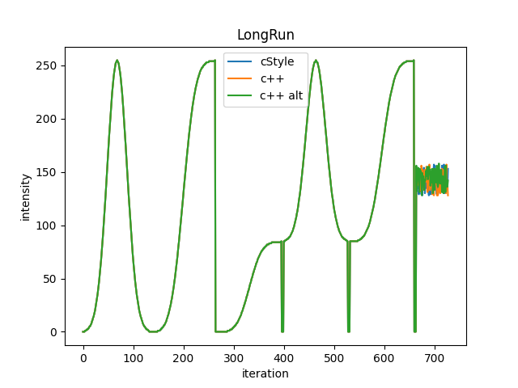

# LightEffectLibrary
A C++ Library to generate different types of light effects.

This library is build to calculate smooth looking light effects and targets to be run on low 
performance embedded Systems. It already ran in a similar implementation on a ATMega32U4 based 
system that easy managed to drive 5 state-machines simultaneously ( see linked video if you like [HighEnd-Lantern](https://www.youtube.com/watch?v=-BYmZQg5hgk)).

The key feater of this approach are three simple things: 
1. **Predefined waveforms**: The naturally appearing light-effects are modeled by utilizing a lookup 
    table of a Gaussian distribution. Hence during operation only simple calculations to step 
    through the predefined curves are needed. 
2. **Waveforms in Series**: Complex waveforms can be generated by just defining a sequence of 
    effect-macros that reference each other. For instance you can create a effect that smoothly 
    turns the light on and begins to "breath" regularly, till the effect is either switched off, or 
    changed. The effect-state-machine will process macro after macro and will switch to the next 
    referenced element which should (or must) lead to a loop at some point.
3. **Cross-Fading without freeze**: If the state-machine is set to a different effect-macro or 
    waveform, the old effect is still maintained for configurable number of cross-fading steps. 
    The effects are further cross-faded which leads to a pleasant smooth transition between the 
    effects regardless of the point at which the effects are changed

In following the key-features are further explained also with graphs.

## Predefined waveforms
All predefined waveforms are precalculated gaussian-like curves that cry to by placed into ROM. 
This library offers a waveform that is resolved with 128 steps. In my own experience 32 steps 
already yield a pleasant smooth appearance. However a script is also included to generate different 
resolutions. Not that the waveforms also can be stepped backwards. 

## Waveforms in series
The waveforms are prepared in a way that one can smoothly turn a light on to idle intensity or full 
intensity. One can also superpose a flash with idle intensity. As the waveforms can be also stepped 
backwards one can turn the lights smoothly off again.
The next picture shows all waveforms in a more or less useable series with short interrupts to 
be able to see the start and end-positions.

An other example is shown in the next picture where the small set of predefined effect macros is 
plotted.

## Cross-Fading
When the state-machine is set to another effect, one has not to take precautions that it has to be 
triggered in a convenient moment (however there still could be any). The Processor keeps the old 
effect alive for the amount of cross-fading steps and gracefully reduces its ratio of the resulting
output. In the meantime the desired effect is ramped up what results in a pleasant transition 
between the two effects. This is visualized in the next picture

At least in my own experience there was no case where this (what i call cross-fade)
lead to an disturbing appearance, even if the fading effect was about to do something spectacular.
The next picture shows an actual calculated example during unit tests.

## Notes
Please note that this is my first projects that i started in C++. It had a strong c-flavor at least 
at the beginning. I sill come back from to time to time to evaluate further features, and still use
it rather as a useful sandbox then as a library that tries to be competitive.
I would love to get your feedback on this or to hear from you if you managed to integrate this lib
in your lighting project.
Actually this library is currently not integrated in any of my projects exactly as is. I used more 
implementations that lead in summary to this library witch could in long therm tidy up the mess in 
the other projects.
